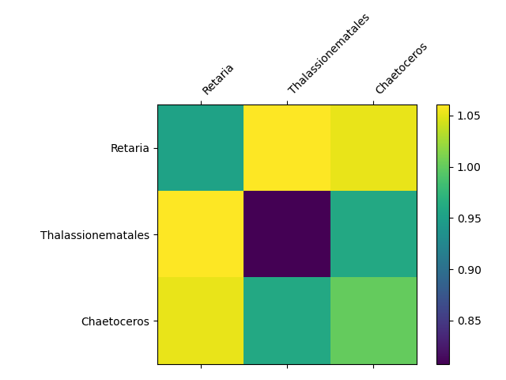
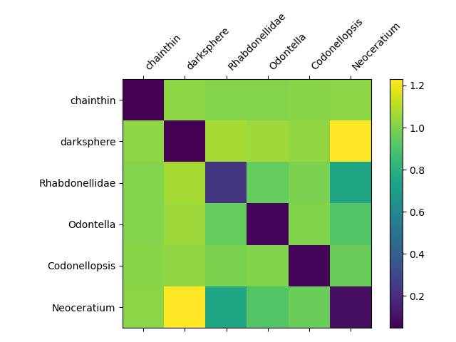
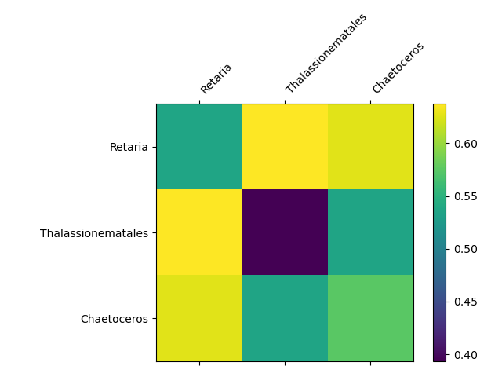
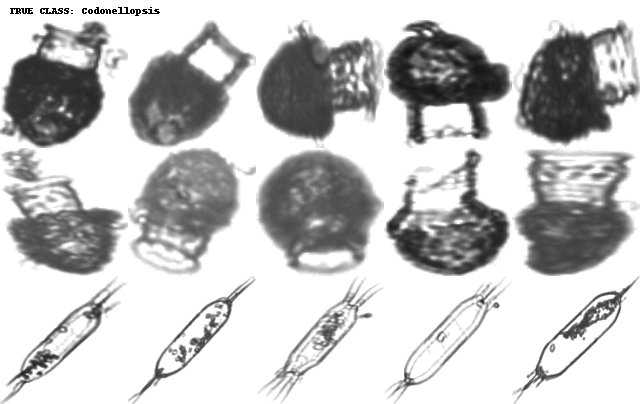
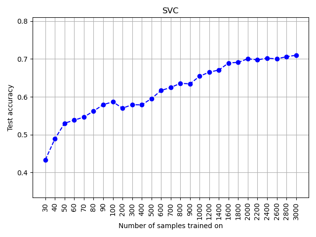
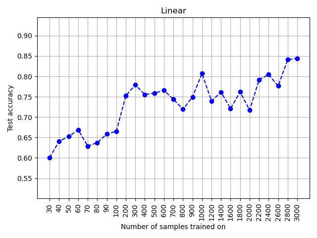
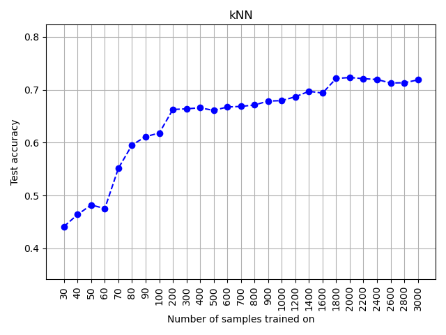

# INF368A Exercise 2
**Odin Hoff Gardå**

## Task 1
To train the triplet loss model, run `train.py` and choose the `triplet_loss` config when prompted.

### Triplet Loss
I choose to implement a triplet loss architecture with online triplet mining. The loss function is defined as $\mathcal(L)(x_a, x_p, x_n) = \operatorname{ReLU}(\Vert f(x_a) - f(x_p) \Vert^2 - \Vert f(x_a) - f(x_n) \Vert^2 + m)$ where $m$ is a margin parameter and $(x_a, x_p, x_n)$ is a valid triplet. That is, $C(x_a) = C(x_p) \neq C(x_n)$ and $x_a \neq x_p$ where $C(x)$ denotes the class of $x$.

**Note:** The embeddings are l2-normalized in the backbone before they are passed to the triplet loss.

### Mining strategy
I implemented an online triplet mining strategy. That is, we extract the embeddings for each sample in the mini-batch, compute the euclidean distance in the embedding space and pick the most useful triplets based on our mining policy. The reason for not doing all triplets (batch-all) or random triplets is to prevent adding triplets with zero loss as these are too easy to learn from. There are two different policies for positives and negatives implemented, respectively. These are:

**Easy positive:** Given an anchor $x_a$, we choose the positive $x_p$ minimizing $\Vert f(x_a) - f(x_p)\Vert^2$.

**Hard positive:** Given an anchor $x_a$, we choose the positive $x_p$ maximizing $\Vert f(x_a) - f(x_p)\Vert^2$.

**Semi-hard negative:** We pick a negative $x_n$ satisfying $\Vert f(x_a) - f(x_p) \Vert^2 < \Vert f(x_a) - f(x_n) \Vert^2 < \Vert f(x_a) - f(x_p) \Vert^2 + m$.

**Hard negative:** We pick a negative $x_n$ satisfying $\Vert f(x_a) - f(x_p) \Vert^2 > \Vert f(x_a) - f(x_n)$. 

If we do not find any negatives satisfying the active policy, the one minimizing $\Vert f(x_a) - f(x_n)\Vert^2$ is choosen to prevent NaNs.

Without these mining policies, the model collapsed. That is, it was satisfied with learning $f(x)=0$ as the loss converged to the value of $m$. To prevent collapse, we train the model for 50 epochs using different combinations of the above policies:

1. Epoch 0 to 14: Easy positives and semi-hard negatives.
2. Epoch 15 to 24: Easy positives and hard negatives.
3. Epoch 25 to 49: Hard positives and hard negatives.

**Note:** For validation loss, we *always* use hard positives and hard negatives.

The use of easy positives in training was inspired by the paper [Improved Embeddings with Easy Positive Triplet Mining](arxiv.org/abs/1904.04370).

### Training
It takes around 12-13 minute to train the model for 50 epochs (when Birget is having a good day) using the above strategy. We used a batch size of 128 and a learning rate of $14\cdot10^{-4}$ with the Adam optimizer. A margin of $m=0.5$ was used for this run, but different values such as 0.3 and 0.2 also give good results.
 

We can see a steady decrease in validation loss during training. There are two jumps in the training loss which are due to the change of mining policies (increasing difficulty). These jumps are not seen in the validation loss since we always compute validation loss using the most difficult triplets.

## Task 2
- Same backbone, but implement CosFace, ArcFace or somthing like that.
- Train model and report

## Task 3 and 4
Embed data and report average distances (use appropriate distance measure)

### Triplet Loss

**Average Euclidean distances between classes**

**Average angular (cosine) distances between classes**

## Task 5
Visualise representations using UMAP for both models

### Triplet Loss

## Task 6
Display images close to center, far-away from center and closest images from other classes. For both models.

### Triplet Loss

## Task 7
Train classifiers on embeddings only.

### Triplet Loss

